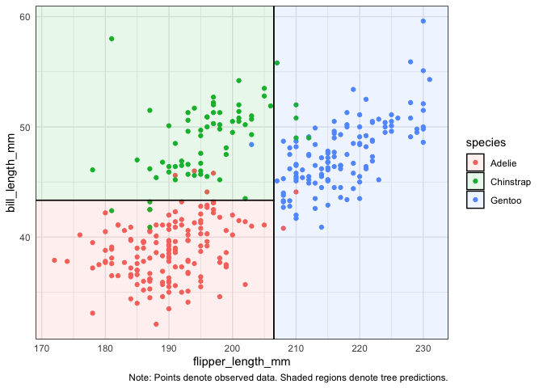
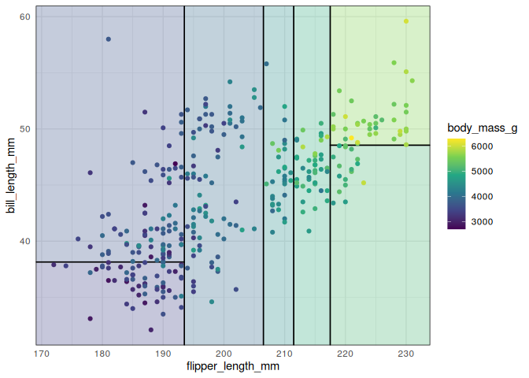
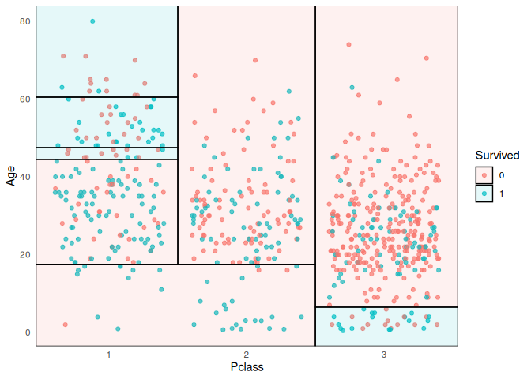
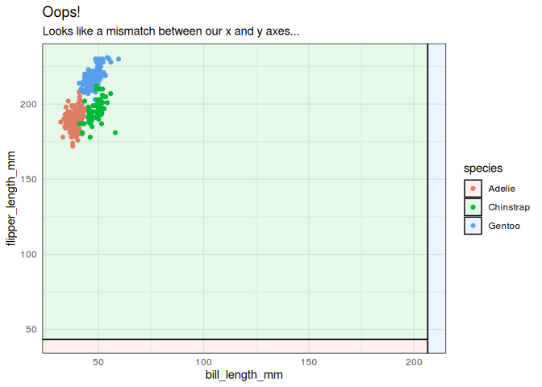
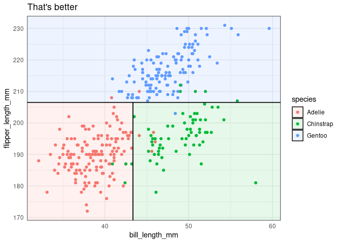
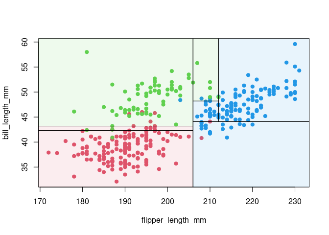

<!-- README.md is generated from README.Rmd. Please edit that file -->

# parttree

<!-- badges: start -->
[](https://github.com/grantmcdermott/parttree/actions)
<!-- badges: end -->

A set of simple functions for visualizing decision tree partitions in R.
The package is optimised to work with
[**ggplot2**](https://ggplot2.tidyverse.org/), although it can be used
to visualize tree partitions with base R graphics too.

-   [Installation](#installation)
-   [Examples](#examples)
-   [Supported model classes](#supported-model-classes)
-   [Plot orientation](#plot-orientation)
-   [Base graphics](#base-graphics)

## Installation

This package is not yet on CRAN, but can be installed from
[GitHub](https://github.com/) with:

``` r
# install.packages("remotes")
remotes::install_github("grantmcdermott/parttree")
```

## Examples

The main function that users will interact with is `geom_parttree()`.
Here’s a simple example using the
[palmerpenguins](https://allisonhorst.github.io/palmerpenguins/)
dataset.

``` r
library("palmerpenguins") ## For 'penguins' dataset
library("rpart")          ## For fitting decisions trees
library("parttree")       ## This package (will automatically load ggplot2 too)
#> Loading required package: ggplot2

## First construct a scatterplot of the raw penguin data
p = ggplot(data = penguins, aes(x = flipper_length_mm, y = bill_length_mm)) +
    geom_point(aes(col = species)) +
    theme_minimal()

## Fit a decision tree using the same variables as the above plot
tree = rpart(species ~ flipper_length_mm + bill_length_mm, data = penguins)

## Visualise the tree partitions by adding it via geom_parttree()
p +  
  geom_parttree(data = tree, aes(fill=species), alpha = 0.1) +
  labs(caption = "Note: Points denote observed data. Shaded regions denote tree predictions.")
#> Warning: Removed 2 rows containing missing values (geom_point).
```



Trees with continuous independent variables are also supported. However,
I recommend adjusting the plot fill aesthetic, since your tree will
likely partition the data into intervals that don’t match up exactly
with the raw data.

``` r
tree2 = rpart(body_mass_g ~ flipper_length_mm + bill_length_mm, data=penguins)

p2 = 
  ggplot(data = penguins, aes(x = flipper_length_mm, y = bill_length_mm)) +
  geom_parttree(data = tree2, aes(fill=body_mass_g), alpha = 0.3) +
  geom_point(aes(col = body_mass_g)) +
  theme_minimal()
  
## Legend scales don't quite match (try it yourself)
# p2

## Better to scale fill to the original data

## This does the job but is still kind of hard to make out (again, try yourself)
# p2 + 
#   scale_fill_continuous(limits = range(penguins$body_mass_g, na.rm = TRUE))

## Even better to combine fill scaling with a mixed colour palette
p2 + 
  scale_colour_viridis_c(
    limits = range(penguins$body_mass_g, na.rm = TRUE), 
    aesthetics = c('colour', 'fill')
    )
#> Warning: Removed 2 rows containing missing values (geom_point).
```



## Supported model classes

Currently, the package works with decision trees created by the
[**rpart**](https://CRAN.R-project.org/web/package=rpart) and
[**partykit**](https://CRAN.R-project.org/web/package=partykit)
packages. Moreover, it supports other front-end modes that call
`rpart::rpart()` as the underlying engine; in particular the
[**tidymodels**](https://www.tidymodels.org/)
([parsnip](https://parsnip.tidymodels.org/) or
[workflows](https://workflows.tidymodels.org/)) and
[**mlr3**](https://mlr3.mlr-org.com/) packages. Here’s an example with
parsnip.

``` r
library("parsnip")
library("titanic") ## Just for a different data set
set.seed(123) ## For consistent jitter

titanic_train$Survived = as.factor(titanic_train$Survived)

## Build our tree using parsnip (but with rpart as the model engine)
ti_tree =
  decision_tree() %>%
  set_engine("rpart") %>%
  set_mode("classification") %>%
  fit(Survived ~ Pclass + Age, data = titanic_train)

## Plot the data and model partitions
titanic_train %>%
  ggplot(aes(x=Pclass, y=Age)) +
  geom_jitter(aes(col=Survived), alpha=0.7) +
  geom_parttree(data = ti_tree, aes(fill=Survived), alpha = 0.1) +
  theme_minimal()
#> Warning: Removed 177 rows containing missing values (geom_point).
```



## Plot orientation

Underneath the hood, `geom_parttree()` is calling the companion
`parttree()` function, which coerces the **rpart** tree object into a
data frame that is easily understood by **ggplot2**. For example,
consider again our first “tree” model from earlier. Here’s the print
output of the raw model.

``` r
tree
#> n=342 (2 observations deleted due to missingness)
#> 
#> node), split, n, loss, yval, (yprob)
#>       * denotes terminal node
#> 
#> 1) root 342 191 Adelie (0.441520468 0.198830409 0.359649123)  
#>   2) flipper_length_mm< 206.5 213  64 Adelie (0.699530516 0.295774648 0.004694836)  
#>     4) bill_length_mm< 43.35 150   5 Adelie (0.966666667 0.033333333 0.000000000) *
#>     5) bill_length_mm>=43.35 63   5 Chinstrap (0.063492063 0.920634921 0.015873016) *
#>   3) flipper_length_mm>=206.5 129   7 Gentoo (0.015503876 0.038759690 0.945736434) *
```

And here’s what we get after we feed it to `parttree()`.

``` r
parttree(tree)
#>   node   species                                                   path  xmin
#> 1    3    Gentoo                             flipper_length_mm >= 206.5 206.5
#> 2    4    Adelie flipper_length_mm <  206.5 --> bill_length_mm <  43.35  -Inf
#> 3    5 Chinstrap flipper_length_mm <  206.5 --> bill_length_mm >= 43.35  -Inf
#>    xmax  ymin  ymax
#> 1   Inf  -Inf   Inf
#> 2 206.5  -Inf 43.35
#> 3 206.5 43.35   Inf
```

Again, the resulting data frame is designed to be amenable to a
**ggplot2** geom layer, with columns like `xmin`, `xmax`, etc.
specifying aesthetics that **ggplot2** recognises. (Fun fact:
`geom_parttree()` is really just a thin wrapper around `geom_rect()`.)
The goal of the package is to abstract away these kinds of details from
the user, so we can just specify `geom_parttree()` — with a valid tree
object as the data input — and be done with it. However, while this
generally works well, it can sometimes lead to unexpected behaviour in
terms of plot orientation. That’s because it’s hard to guess ahead of
time what the user will specify as the x and y variables (i.e. axes) in
their other plot layers. To see what I mean, let’s redo our penguin plot
from earlier, but this time switch the axes in the main `ggplot()` call.

``` r
## First, redo our first plot but this time switch the x and y variables
p3 = 
  ggplot(
    data = penguins, 
    aes(x = bill_length_mm, y = flipper_length_mm) ## Switched!
    ) +
  geom_point(aes(col = species)) +  
  theme_minimal()

## Add on our tree (and some preemptive titling..)
p3 +
  geom_parttree(data = tree, aes(fill = species), alpha = 0.1) +
  labs(
    title = "Oops!",
    subtitle = "Looks like a mismatch between our x and y axes..."
    )
#> Warning: Removed 2 rows containing missing values (geom_point).
```



As was the case here, this kind of orientation mismatch is normally
(hopefully) pretty easy to recognize. To fix, we can use the
`flipaxes = TRUE` argument to flip the orientation of the
`geom_parttree` layer.

``` r
p3 +
  geom_parttree(
    data = tree, aes(fill = species), alpha = 0.1,
    flipaxes = TRUE  ## Flip the orientation
    ) +
  labs(title = "That's better")
#> Warning: Removed 2 rows containing missing values (geom_point).
```



## Base graphics

While the package has been primarily designed to work with **ggplot2**,
the `parttree()` infrastructure can also be used to generate plots with
base graphics. Here, the `ctree()` function from **partykit** is used
for fitting the tree.

``` r
library("partykit")
#> Loading required package: grid
#> Loading required package: libcoin
#> Loading required package: mvtnorm

## CTree and corresponding partition
ct = ctree(species ~ flipper_length_mm + bill_length_mm, data = penguins)
pt = parttree(ct)

## Color palette
pal <- palette.colors(4, "R4")[-1]

## Maximum/minimum for plotting range as rect() does not handle Inf well
m <- 1000

## scatter plot() with added rect()
plot(bill_length_mm ~ flipper_length_mm, data = penguins, col = pal[species], pch = 19)
rect(pmax(-m, pt$xmin), pmax(-m, pt$ymin), pmin(m, pt$xmax), pmin(m, pt$ymax),
  col = adjustcolor(pal, alpha.f = 0.1)[pt$species])
```


