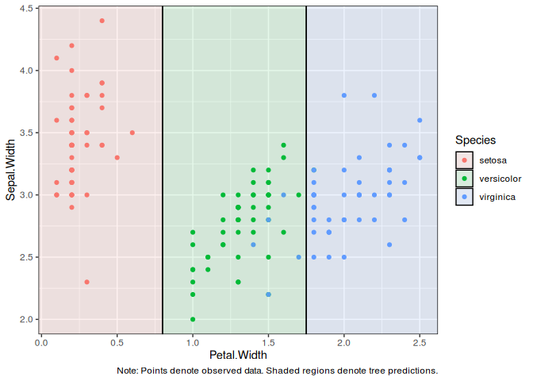

<!-- README.md is generated from README.Rmd. Please edit that file -->

# parttree

<!-- badges: start -->

<!-- badges: end -->

A set of simple functions for plotting 2D decision tree partitions in R.

## Installation

This package is not yet on CRAN, but can be installed from
[GitHub](https://github.com/) with:

``` r
# install.packages("remotes")
remotes::install_github("grantmcdermott/parttree")
```

## Examples

``` r
library(rpart)
library(parttree)

d = part_tree(rpart(Species ~ Sepal.Width + Petal.Width, data=iris))
d
#>    node                                       path xmin xmax ymin ymax
#> 1:    2                         Petal.Width <  0.8 -Inf 0.80 -Inf  Inf
#> 2:    6 Petal.Width >= 0.8 --> Petal.Width <  1.75 0.80 1.75 -Inf  Inf
#> 3:    7 Petal.Width >= 0.8 --> Petal.Width >= 1.75 1.75  Inf -Inf  Inf
#>       Species
#> 1:     setosa
#> 2: versicolor
#> 3:  virginica
```

The return object is designed to be compatible with **ggplot2** (in
particular, `geom_rect`). This makes it convenient for visualizing
partitions in conjunction with the original data.

``` r
library(ggplot2)

ggplot() +
  geom_point(data = iris, aes(x=Petal.Width, y=Sepal.Width, col=Species)) +
  geom_rect(
    data = d, alpha = 0.1, col = "black",
    aes(xmin=xmin, ymin=ymin, xmax=xmax, ymax=ymax, fill=Species)
    ) 
```



Currently, the function only works with decision trees created by the
**rpart** package. However, it does support other packages and modes
that call `rpart()` as the underlying engine. Here’s an example using
the **parsnip** package.

``` r
library(titanic) ## Just for a different data set
library(parsnip)

titanic_train$Survived = as.factor(titanic_train$Survived)

## Build our tree using parsnip (but with rpart as the model engine)
ti_tree =
  decision_tree() %>%
  set_engine("rpart") %>%
  set_mode("classification") %>%
  fit(Survived ~ Pclass + Age, data = titanic_train)

## Plot the data and model partitions
ggplot() +
  geom_jitter(
    data = titanic_train,
    aes(x=Pclass, y=Age, col=Survived), alpha=0.7
    ) +
  geom_rect(
    data = part_tree(ti_tree), alpha = 0.1, col = "black",
    aes(xmin=xmin, ymin=ymin, xmax=xmax, ymax=ymax, fill=Survived)
    ) +
  theme_minimal() +
  theme(panel.grid = element_blank())
#> Warning: Removed 177 rows containing missing values (geom_point).
```


