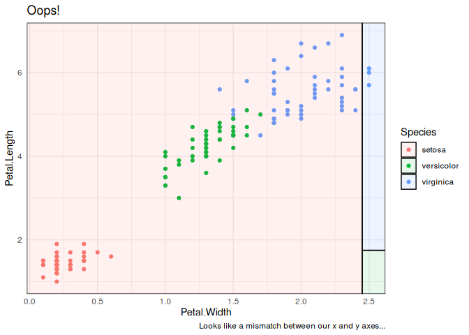

<!-- README.md is generated from README.Rmd. Please edit that file -->

# parttree

<!-- badges: start -->

<!-- badges: end -->

A set of simple functions for visualizing decision tree partitions in R
with [**ggplot2**](https://ggplot2.tidyverse.org/).

## Installation

This package is not yet on CRAN, but can be installed from
[GitHub](https://github.com/) with:

``` r
# install.packages("remotes")
remotes::install_github("grantmcdermott/parttree")
```

## Example

The main function that users will interact with is `geom_parttree()`.
Here’s a simple example.

``` r
library(parttree)
library(rpart)
library(ggplot2)

iris_tree = rpart(Species ~ Petal.Length + Petal.Width, data=iris)

## Let's construct a scatterplot of the original iris data
p = ggplot(data = iris, aes(x=Petal.Length, y=Petal.Width)) +
  geom_point(aes(col=Species))

## We now add the partitions with geom_parttree()
p +  
  geom_parttree(data = iris_tree, aes(fill=Species), alpha = 0.1) +
  labs(caption = "Note: Points denote observed data. Shaded regions denote tree predictions.")  +
  theme_minimal()
```


## Limitations and caveats

### Supported model classes

Currently, the package only works with decision trees created by the
[**rpart**](https://cran.r-project.org/web/packages/rpart/index.html)
package. However, it does support other front-end modes that call
`rpart::rpart()` as the underlying engine; in particular the
[**parsnip**](https://tidymodels.github.io/parsnip/) and
[**mlr3**](https://mlr3.mlr-org.com/) packages. Here’s an example with
the former.

``` r
library(parsnip)
library(titanic) ## Just for a different data set
set.seed(123) ## For consistent jitter

titanic_train$Survived = as.factor(titanic_train$Survived)

## Build our tree using parsnip (but with rpart as the model engine)
ti_tree =
  decision_tree() %>%
  set_engine("rpart") %>%
  set_mode("classification") %>%
  fit(Survived ~ Pclass + Age, data = titanic_train)

## Plot the data and model partitions
titanic_train %>%
  ggplot(aes(x=Pclass, y=Age)) +
  geom_jitter(aes(col=Survived), alpha=0.7) +
  geom_parttree(data = ti_tree, aes(fill=Survived), alpha = 0.1) +
  theme_minimal()
#> Warning: Removed 177 rows containing missing values (geom_point).
```


### Plot orientation

Underneath the hood, `geom_parttree()` is calling the companion
`parttree()` function, which coerces the **rpart** tree object into a
data frame that is easily understood by **ggplot2**. For example,
consider again the “iris\_tree” model from earlier. Here’s the print
output of the raw model.

``` r
iris_tree
#> n= 150 
#> 
#> node), split, n, loss, yval, (yprob)
#>       * denotes terminal node
#> 
#> 1) root 150 100 setosa (0.33333333 0.33333333 0.33333333)  
#>   2) Petal.Length< 2.45 50   0 setosa (1.00000000 0.00000000 0.00000000) *
#>   3) Petal.Length>=2.45 100  50 versicolor (0.00000000 0.50000000 0.50000000)  
#>     6) Petal.Width< 1.75 54   5 versicolor (0.00000000 0.90740741 0.09259259) *
#>     7) Petal.Width>=1.75 46   1 virginica (0.00000000 0.02173913 0.97826087) *
```

And here’s what we get after we feed it to `parttree()`.

``` r
parttree(iris_tree)
#>   node    Species                                         path xmin xmax ymin
#> 1    2     setosa                         Petal.Length <  2.45 -Inf 2.45 -Inf
#> 2    6 versicolor Petal.Length >= 2.45 --> Petal.Width <  1.75 2.45  Inf -Inf
#> 3    7  virginica Petal.Length >= 2.45 --> Petal.Width >= 1.75 2.45  Inf 1.75
#>   ymax
#> 1  Inf
#> 2 1.75
#> 3  Inf
```

Again, the resulting data frame is designed to be amenable to a
**ggplot2** geom layer, with columns like `xmin`, `xmax`, etc.
specifying aesthetics that **ggplot2** recognises. (Fun fact:
`geom_parttree()` is really just a thin wrapper around `geom_rect()`.)
The goal of the package is to abstract away these kinds of details from
the user, so we can just specify `geom_parttree()` — with a valid tree
object as the data input — and be done with it. However, while this
generally works well, it can sometimes lead to unexpected behaviour in
terms of plot orientation. That’s because it’s hard to guess ahead of
time what the user will specify as the x and y variables (i.e. axes) in
their other plot layers. To see what I mean, let’s redo our iris plot
from earlier, but this time switch the axes in the main `ggplot()` call.

``` r
iris %>%
  ggplot(aes(x=Petal.Width, y=Petal.Length)) + ## Changed!
  geom_point(aes(col=Species)) +  
  geom_parttree(data = iris_tree, aes(fill=Species), alpha = 0.1) +
  labs(
    title = "Oops!",
    caption = "Looks like a mismatch between our x and y axes...")  +
  theme_minimal()
```



Normally, this kind of orientation mismatch should be pretty easy to
recognize (as is the case here). But it’s admittedly annoying. I’ll try
to add better support for catching/avoiding these kinds of errors in a
future update, but as of the moment: *caveat emptor*.
