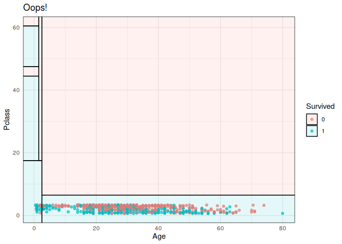

<!-- README.md is generated from README.Rmd. Please edit that file -->

# parttree

<!-- badges: start -->

<!-- badges: end -->

A set of simple functions for visualizing decision tree partitions in R
with [**ggplot2**](https://ggplot2.tidyverse.org/).

## Installation

This package is not yet on CRAN, but can be installed from
[GitHub](https://github.com/) with:

``` r
# install.packages("remotes")
remotes::install_github("grantmcdermott/parttree")
```

## Example

``` r
library(parttree)
library(rpart)
library(ggplot2)

iris_tree = rpart(Species ~ Sepal.Width + Petal.Width, data=iris)

## Let's construct a scatterplot of the original iris data
p = ggplot(data = iris, aes(x=Petal.Width, y=Sepal.Width)) +
  geom_point(aes(col=Species))

## We now add the partitions with geom_parttree()
p +  
  geom_parttree(data = iris_tree, aes(fill=Species), alpha = 0.1) +
  labs(caption = "Note: Points denote observed data. Shaded regions denote tree predictions.") 
```


The main goal of the package is to visualize decision tree objects
(e.g. created with
[**rpart**](https://cran.r-project.org/web/packages/rpart/index.html))
into a data frame, which is amenable to visualizing as a partition plot.
Here’s a simple example using everyone’s favourite `iris` dataset.

## Limitations and caveats

### Supported model classes

Currently, the function only works with decision trees created by the
[**rpart**](https://cran.r-project.org/web/packages/rpart/index.html)
package. However, it does support other packages and modes that call
`rpart::rpart()` as the underlying engine. Here’s an example using the
[**parsnip**](https://tidymodels.github.io/parsnip/) package.

``` r
library(parsnip)
library(titanic) ## Just for a different data set
set.seed(123) ## For consistent jitter

titanic_train$Survived = as.factor(titanic_train$Survived)

## Build our tree using parsnip (but with rpart as the model engine)
ti_tree =
  decision_tree() %>%
  set_engine("rpart") %>%
  set_mode("classification") %>%
  fit(Survived ~ Pclass + Age, data = titanic_train)

## Plot the data and model partitions
titanic_train %>%
  ggplot(aes(x=Pclass, y=Age)) +
  geom_jitter(aes(col=Survived), alpha=0.7) +
  geom_parttree(data = ti_tree, aes(fill=Survived), alpha = 0.1) +
  theme_minimal()
#> Warning: Removed 177 rows containing missing values (geom_point).
```


### Orientation

Underneath the hood, `geom_partree()` is calling the companion
`parttree()` function, which coerces the **rpart** tree object into a
data frame that is easily understood by **ggplot2**. For example,
consider our “ti\_tree” model from above.

``` r
parttree(ti_tree)
#>   node Survived
#> 1    4        0
#> 2    5        1
#> 3    7        1
#> 4   12        0
#> 5   27        1
#> 6   52        0
#> 7  106        0
#> 8  107        1
#>                                                                                              path
#> 1                                                                    Pclass >= 2.5 --> Age >= 6.5
#> 2                                                                    Pclass >= 2.5 --> Age <  6.5
#> 3                                                                   Pclass <  2.5 --> Age <  17.5
#> 4                                                 Pclass <  2.5 --> Age >= 17.5 --> Pclass >= 1.5
#> 5                                 Pclass <  2.5 --> Age >= 17.5 --> Pclass <  1.5 --> Age <  44.5
#> 6                 Pclass <  2.5 --> Age >= 17.5 --> Pclass <  1.5 --> Age >= 44.5 --> Age >= 60.5
#> 7 Pclass <  2.5 --> Age >= 17.5 --> Pclass <  1.5 --> Age >= 44.5 --> Age <  60.5 --> Age <  47.5
#> 8 Pclass <  2.5 --> Age >= 17.5 --> Pclass <  1.5 --> Age >= 44.5 --> Age <  60.5 --> Age >= 47.5
#>   xmin xmax ymin ymax
#> 1  2.5  Inf  6.5  Inf
#> 2  2.5  Inf -Inf  6.5
#> 3 -Inf  2.5 -Inf 17.5
#> 4  1.5  2.5 17.5  Inf
#> 5 -Inf  1.5 17.5 44.5
#> 6 -Inf  1.5 60.5  Inf
#> 7 -Inf  1.5 44.5 47.5
#> 8 -Inf  1.5 47.5 60.5
```

Again, the resulting data frame is designed to amenable to a **ggplot2**
geom layer, with columns like `xmin`, `xmax`, etc. specifying aesthetics
that **ggplot2** recognises. (Fun fact: `geom_partree()` is really just
a thin wrapper around `geom_rect()`). The goal is to abstract these
kinds of details away from the user so we can just specify
`geom_partree()` \&mdash with a valid tree object as the data input —
and be done with it. However, while this generally works fine, it can
sometimes lead to unexpected behaviour in terms of plot orientation.
That’s because it’s hard to guess ahead of time what the user will
specify as the *x* and *y* axes/variables in their other plot layers. To
see what I mean, let’s redo our titanic plot from earlier, but this time
switch the axes in the main *ggplot()* call.

``` r
titanic_train %>%
  ggplot(aes(x=Age, y=Pclass)) + ## Changed!
  geom_jitter(aes(col=Survived), alpha=0.7) +
  geom_parttree(data = ti_tree, aes(fill=Survived), alpha = 0.1) +
  theme_minimal() +
  labs(title = "Oops!")
#> Warning: Removed 177 rows containing missing values (geom_point).
```



Now, normally this kind of orientation mismatch should hopefully be
pretty easy to identify. But its admittedly annoying. I’ll try to add
better support for catching/avoiding these kinds of errors in a future
update, but as of the moment *caveat emptor*.
