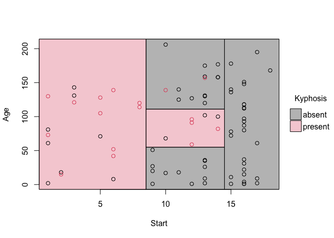

<!-- README.md is generated from README.Rmd. Please edit that file -->

# parttree <a href='https://grantmcdermott.com/parttree/'></a>

<!-- badges: start -->

[](https://CRAN.R-project.org/package=parttree)
[](https://grantmcdermott.r-universe.dev)
[](https://github.com/grantmcdermott/parttree/actions/workflows/R-CMD-check.yaml)
[](https://grantmcdermott.com/parttree/index.html)
<!-- badges: end -->

Visualize simple 2-D decision tree partitions in R. The **parttree**
package provides visualization methods for both base R graphics (via
[**tinyplot**](https://grantmcdermott.com/tinyplot/)) and
[**ggplot2**](https://ggplot2.tidyverse.org/).

## Installation

The stable version of **parttree** is available on CRAN.

``` r
install.packages("parttree")
```

Or, you can grab the latest development version from
[R-universe](https://grantmcdermott.r-universe.dev/parttree).

``` r
install.packages("parttree", repos = "https://grantmcdermott.r-universe.dev")
```

## Quickstart

The **parttree**
[homepage](https://grantmcdermott.com/parttree/index.html) includes an
introductory vignette and detailed documentation. But here’s a
quickstart example using the
[“kyphosis”](https://search.r-project.org/CRAN/refmans/rpart/html/kyphosis.html)
dataset that comes bundled with the **rpart** package. In this case, we
are interested in predicting kyphosis recovery after spinal surgery, as
a function of 1) the number of topmost vertebra that were operated, and
2) patient age.

The key function is `parttree()`, which comes with its own plotting
method.

``` r
library(rpart)     # For the dataset and fitting decisions trees
library(parttree)  # This package

fit = rpart(Kyphosis ~ Start + Age, data = kyphosis)

# Grab the partitions and plot
fit_pt = parttree(fit)
plot(fit_pt)
```



Customize your plots by passing additional arguments:

``` r
plot(
   fit_pt,
   border  = NA,                                     # no partition borders
   pch     = 19,                                     # filled points
   alpha   = 0.6,                                    # point transparency
   grid    = TRUE,                                   # background grid
   palette = "classic",                              # new colour palette
   xlab    = "Topmost vertebra operated on",         # custom x title
   ylab    = "Patient age (months)",                 # custom y title
   main    = "Tree predictions: Kyphosis recurrence" # custom title
)
```


### ggplot2

For **ggplot2** users, we offer an equivalent workflow via the
`geom_partree()` visualization layer.

``` r
library(ggplot2) ## Should be loaded separately

ggplot(kyphosis, aes(x = Start, y = Age)) +
  geom_parttree(data = fit, alpha = 0.1, aes(fill = Kyphosis)) + # <-- key layer
  geom_point(aes(col = Kyphosis)) +
  labs(
    x = "No. of topmost vertebra operated on", y = "Patient age (months)",
    caption = "Note: Points denote observations. Shading denotes model predictions."
    ) +
  theme_minimal()
```


