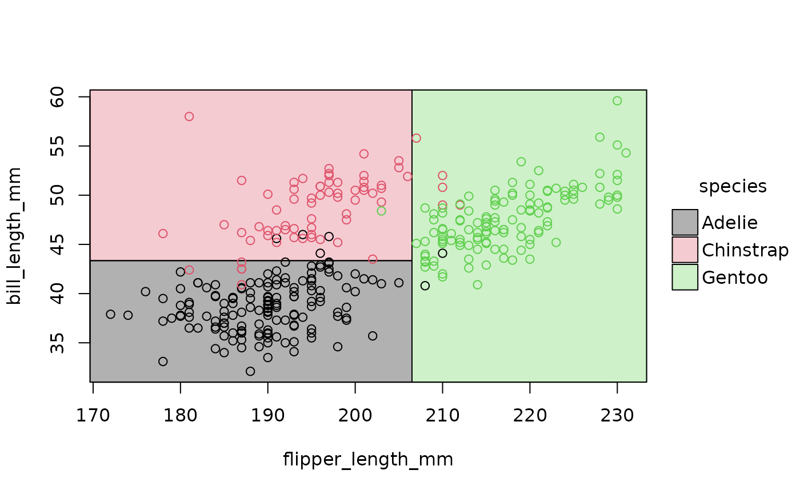
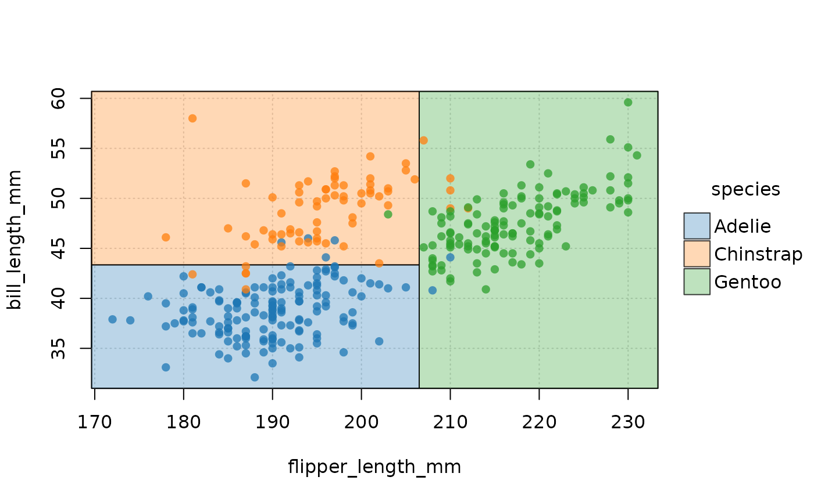
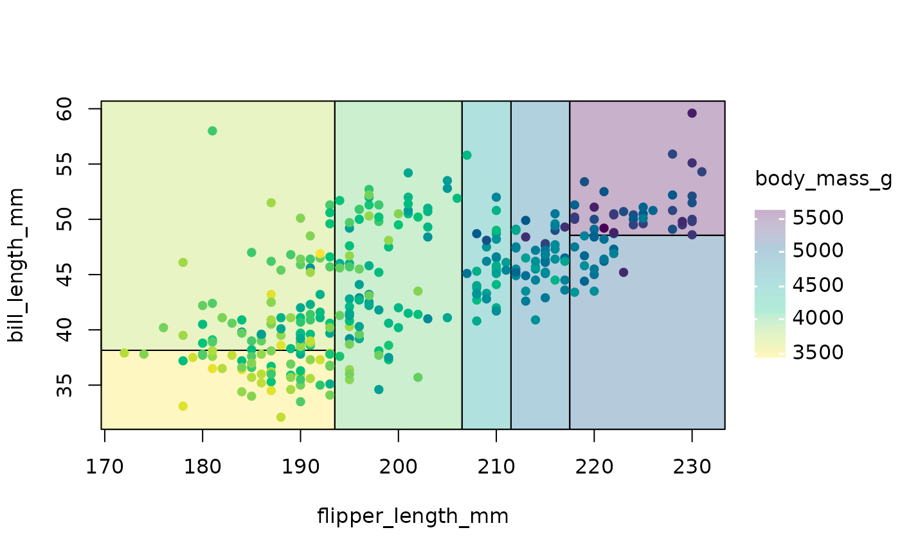
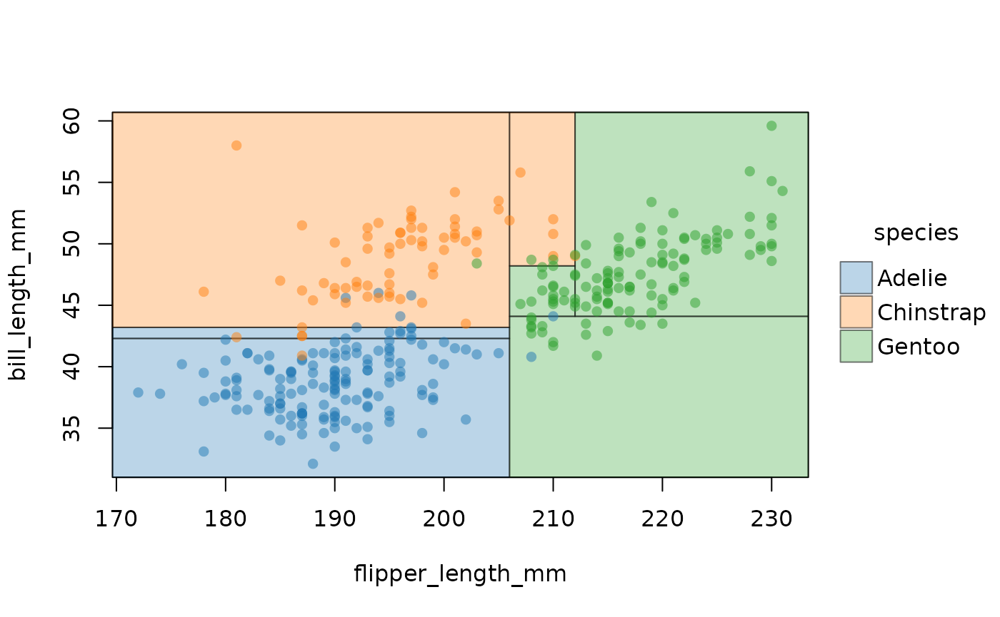
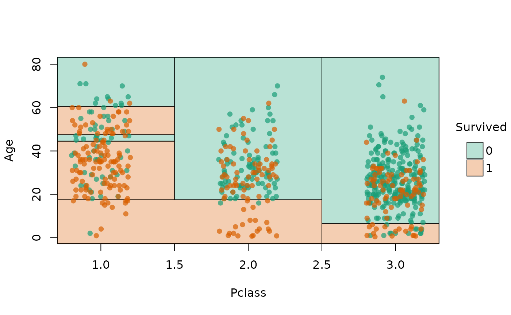
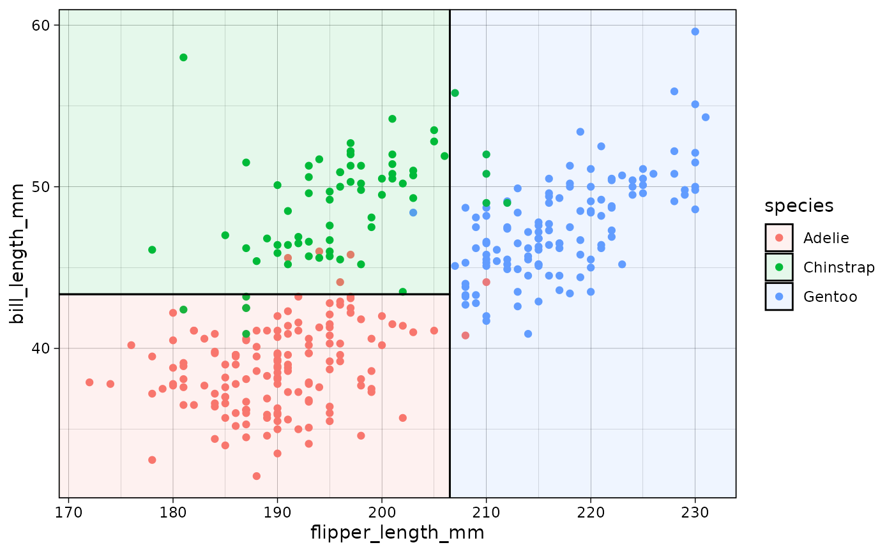
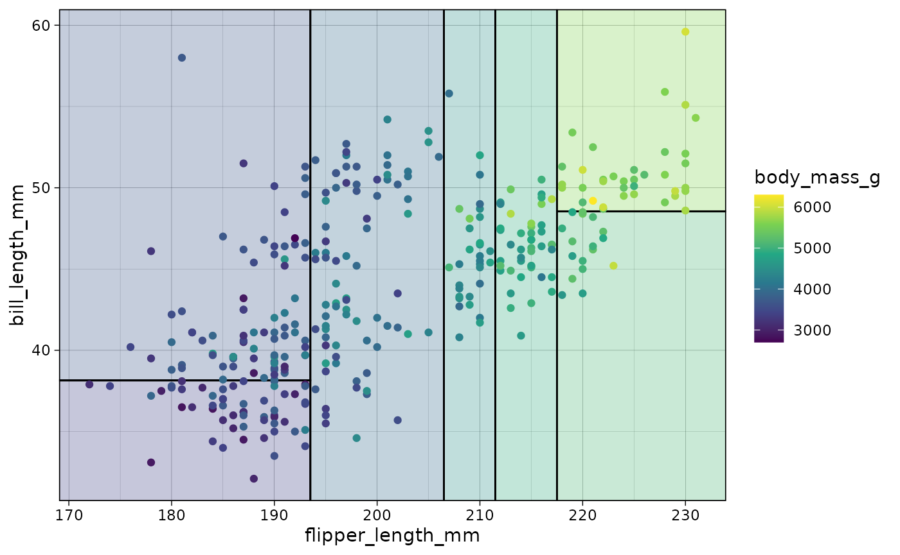
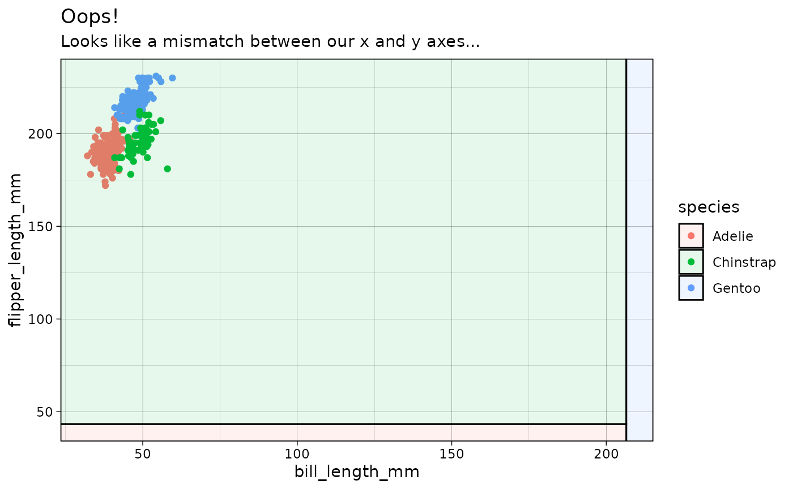
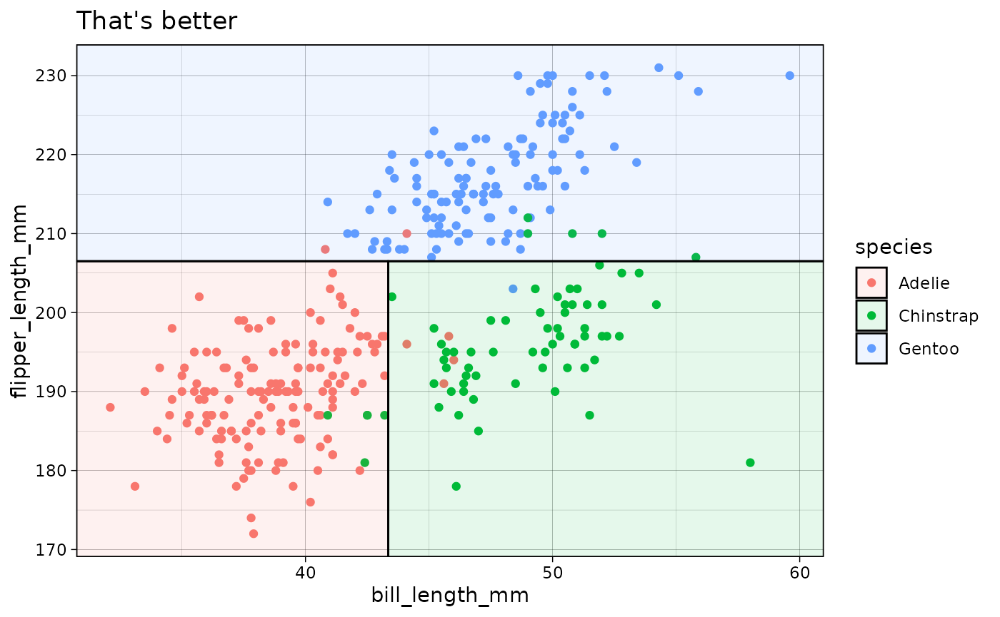

# Introduction to parttree

## Motivating example: Classifying penguin species

Start by loading the **parttree** package alongside **rpart**, which
comes bundled with the base R installation. For the basic examples that
follow, I’ll use the well-known [Palmer
Penguins](https://allisonhorst.github.io/palmerpenguins/) dataset to
demonstrate functionality. You can load this dataset via the parent
package (as I have here), or import it directly as a CSV
[here](https://vincentarelbundock.github.io/Rdatasets/csv/palmerpenguins/penguins.csv).

``` r
library(parttree)  # This package
library(rpart)     # For fitting decisions trees

# install.packages("palmerpenguins")
data("penguins", package = "palmerpenguins")
head(penguins)
#> # A tibble: 6 × 8
#>   species island    bill_length_mm bill_depth_mm flipper_length_mm body_mass_g
#>   <fct>   <fct>              <dbl>         <dbl>             <int>       <int>
#> 1 Adelie  Torgersen           39.1          18.7               181        3750
#> 2 Adelie  Torgersen           39.5          17.4               186        3800
#> 3 Adelie  Torgersen           40.3          18                 195        3250
#> 4 Adelie  Torgersen           NA            NA                  NA          NA
#> 5 Adelie  Torgersen           36.7          19.3               193        3450
#> 6 Adelie  Torgersen           39.3          20.6               190        3650
#> # ℹ 2 more variables: sex <fct>, year <int>
```

Dataset in hand, let’s say that we are interested in predicting penguin
*species* as a function of 1) flipper length and 2) bill length. We
could model this as a simple decision tree:

``` r
tree = rpart(species ~ flipper_length_mm + bill_length_mm, data = penguins)
tree
#> n=342 (2 observations deleted due to missingness)
#> 
#> node), split, n, loss, yval, (yprob)
#>       * denotes terminal node
#> 
#> 1) root 342 191 Adelie (0.441520468 0.198830409 0.359649123)  
#>   2) flipper_length_mm< 206.5 213  64 Adelie (0.699530516 0.295774648 0.004694836)  
#>     4) bill_length_mm< 43.35 150   5 Adelie (0.966666667 0.033333333 0.000000000) *
#>     5) bill_length_mm>=43.35 63   5 Chinstrap (0.063492063 0.920634921 0.015873016) *
#>   3) flipper_length_mm>=206.5 129   7 Gentoo (0.015503876 0.038759690 0.945736434) *
```

Like most tree-based frameworks, **rpart** comes with a default `plot`
method for visualizing the resulting node splits.

``` r
plot(tree, compress = TRUE)
text(tree, use.n = TRUE)
```


While this is okay, I don’t feel that it provides much intuition about
the model’s prediction on the *scale of the actual data*. In other
words, what I’d prefer to see is: How has our tree partitioned the
original penguin data?

This is where **parttree** enters the fray. The package is named for its
primary workhorse function
[`parttree()`](https://grantmcdermott.com/parttree/reference/parttree.md),
which extracts all of the information needed to produce a nice plot of
our tree partitions alongside the original data.

``` r
ptree = parttree(tree)
plot(ptree)
```



*Et voila!* Now we can clearly see how our model has divided up the
Cartesian space of the data. Gentoo penguins typically have longer
flippers than Chinstrap or Adelie penguins, while the latter have the
shortest bills.

From the perspective of the end-user, the `ptree` parttree object is not
all that interesting in of itself. It is simply a data frame that
contains the basic information needed for our plot (partition
coordinates, etc.). You can think of it as a helpful intermediate object
on our way to the visualization of interest.

``` r
# See also `attr(ptree, "parttree")`
ptree
#>   node   species                                                  path  xmin
#> 1    3    Gentoo                            flipper_length_mm >= 206.5 206.5
#> 2    4    Adelie  flipper_length_mm < 206.5 --> bill_length_mm < 43.35  -Inf
#> 3    5 Chinstrap flipper_length_mm < 206.5 --> bill_length_mm >= 43.35  -Inf
#>    xmax  ymin  ymax
#> 1   Inf  -Inf   Inf
#> 2 206.5  -Inf 43.35
#> 3 206.5 43.35   Inf
```

Speaking of visualization, underneath the hood `plot.parttree` calls the
powerful [**tinyplot**](https://grantmcdermott.com/tinyplot/) package.
All of the latter’s various customization arguments can be passed on to
our `parttree` plot to make it look a bit nicer. For example:

``` r
plot(ptree, pch = 16, palette = "classic", alpha = 0.75, grid = TRUE)
```



### Continuous predictions

In addition to discrete classification problems, **parttree** also
supports regression trees with continuous independent variables.

``` r
tree_cont = rpart(body_mass_g ~ flipper_length_mm + bill_length_mm, data = penguins)

tree_cont |>
  parttree() |>
  plot(pch = 16, palette = "viridis")
```



## Supported model classes

Alongside the [**rpart**](https://CRAN.R-project.org/package=rpart)
model objects that we have been working with thus far, **parttree** also
supports decision trees created by the
[**partykit**](https://CRAN.R-project.org/package=partykit) package.
Here we see how the latter’s `ctree` (conditional inference tree)
algorithm yields a slightly more sophisticated partitioning that the
former’s default.

``` r
library(partykit)
#> Loading required package: grid
#> Loading required package: libcoin
#> Loading required package: mvtnorm

ctree(species ~ flipper_length_mm + bill_length_mm, data = penguins) |>
  parttree() |>
  plot(pch = 16, palette = "classic", alpha = 0.5)
```



**parttree** also supports a variety of “frontend” modes that call
[`rpart::rpart()`](https://rdrr.io/pkg/rpart/man/rpart.html) as the
underlying engine. This includes packages from both the
[**mlr3**](https://mlr3.mlr-org.com/) and
[**tidymodels**](https://www.tidymodels.org/)
([parsnip](https://parsnip.tidymodels.org/) or
[workflows](https://workflows.tidymodels.org/)) ecosystems. Here is a
quick demonstration using **parsnip**, where we’ll also pull in a
different dataset just to change things up a little.

``` r
set.seed(123) ## For consistent jitter

library(parsnip)
library(titanic) ## Just for a different data set

titanic_train$Survived = as.factor(titanic_train$Survived)

## Build our tree using parsnip (but with rpart as the model engine)
ti_tree =
  decision_tree() |>
  set_engine("rpart") |>
  set_mode("classification") |>
  fit(Survived ~ Pclass + Age, data = titanic_train)
## Now pass to parttree and plot
ti_tree |>
  parttree() |>
  plot(pch = 16, jitter = TRUE, palette = "dark", alpha = 0.7)
```



## ggplot2

The default `plot.parttree` method produces a base graphics plot. But we
also support **ggplot2** via with a dedicated
[`geom_parttree()`](https://grantmcdermott.com/parttree/reference/geom_parttree.md)
function. Here we demonstrate with our initial classification tree from
earlier.

``` r
library(ggplot2)
theme_set(theme_linedraw())

## re-using the tree model object from above...
ggplot(data = penguins, aes(x = flipper_length_mm, y = bill_length_mm)) +
  geom_point(aes(col = species)) +
  geom_parttree(data = tree, aes(fill=species), alpha = 0.1)
```



Compared to the “native” `plot.parttree` method, note that the
**ggplot2** workflow requires a few tweaks:

- We need to need to plot the original dataset as a separate layer
  (i.e.,
  [`geom_point()`](https://ggplot2.tidyverse.org/reference/geom_point.html)).
- [`geom_parttree()`](https://grantmcdermott.com/parttree/reference/geom_parttree.md)
  accepts the tree object *itself*, not the result of
  [`parttree()`](https://grantmcdermott.com/parttree/reference/parttree.md).[¹](#fn1)

Continuous regression trees can also be drawn with `geom_parttree`.
However, I recommend adjusting the plot fill aesthetic since your model
will likely partition the data into intervals that don’t match up
exactly with the raw data. The easiest way to do this is by setting your
colour and fill aesthetic together as part of the same `scale_colour_*`
call.

``` r
## re-using the tree_cont model object from above...
ggplot(data = penguins, aes(x = flipper_length_mm, y = bill_length_mm)) +
  geom_parttree(data = tree_cont, aes(fill=body_mass_g), alpha = 0.3) +
  geom_point(aes(col = body_mass_g)) + 
  scale_colour_viridis_c(aesthetics = c('colour', 'fill')) # NB: Set colour + fill together
```



### Gotcha: (gg)plot orientation

As we have already said,
[`geom_parttree()`](https://grantmcdermott.com/parttree/reference/geom_parttree.md)
calls the companion
[`parttree()`](https://grantmcdermott.com/parttree/reference/parttree.md)
function internally, which coerces the **rpart** tree object into a data
frame that is easily understood by **ggplot2**. For example, consider
our initial “ptree” object from earlier.

``` r
# ptree = parttree(tree)
ptree
#>   node   species                                                  path  xmin
#> 1    3    Gentoo                            flipper_length_mm >= 206.5 206.5
#> 2    4    Adelie  flipper_length_mm < 206.5 --> bill_length_mm < 43.35  -Inf
#> 3    5 Chinstrap flipper_length_mm < 206.5 --> bill_length_mm >= 43.35  -Inf
#>    xmax  ymin  ymax
#> 1   Inf  -Inf   Inf
#> 2 206.5  -Inf 43.35
#> 3 206.5 43.35   Inf
```

Again, the resulting data frame is designed to be amenable to a
**ggplot2** geom layer, with columns like `xmin`, `xmax`, etc.
specifying aesthetics that **ggplot2** recognizes. (Fun fact:
[`geom_parttree()`](https://grantmcdermott.com/parttree/reference/geom_parttree.md)
is really just a thin wrapper around
[`geom_rect()`](https://ggplot2.tidyverse.org/reference/geom_tile.html).)
The goal of **parttree** is to abstract away these kinds of details from
the user, so that they can just specify
[`geom_parttree()`](https://grantmcdermott.com/parttree/reference/geom_parttree.md)—with
a valid tree object as the data input—and be done with it. However,
while this generally works well, it can sometimes lead to unexpected
behaviour in terms of plot orientation. That’s because it’s hard to
guess ahead of time what the user will specify as the x and y variables
(i.e. axes) in their other **ggplot2** layers.[²](#fn2) To see what I
mean, let’s redo our penguin plot from earlier, but this time switch the
axes in the main
[`ggplot()`](https://ggplot2.tidyverse.org/reference/ggplot.html) call.

``` r
## First, redo our first plot but this time switch the x and y variables
p3 = ggplot(
  data = penguins, 
  aes(x = bill_length_mm, y = flipper_length_mm) ## Switched!
  ) +
  geom_point(aes(col = species))

## Add on our tree (and some preemptive titling..)
p3 +
  geom_parttree(data = tree, aes(fill = species), alpha = 0.1) +
  labs(
    title = "Oops!",
    subtitle = "Looks like a mismatch between our x and y axes..."
  )
```



As was the case here, this kind of orientation mismatch is normally
(hopefully) pretty easy to recognize. To fix, we can use the
`flip = TRUE` argument to flip the orientation of the `geom_parttree`
layer.

``` r
p3 +
  geom_parttree(
    data = tree, aes(fill = species), alpha = 0.1,
    flip = TRUE  ## Flip the orientation
  ) +
  labs(title = "That's better")
```



------------------------------------------------------------------------

1.  This is because `geom_parttree(data = <tree>)` calls
    `parttree(<tree>)` internally.

2.  The default `plot.partree` method doesn’t have this problem because
    it assigns the x and y variables for both the partitions and raw
    data points as part of the same function call.
